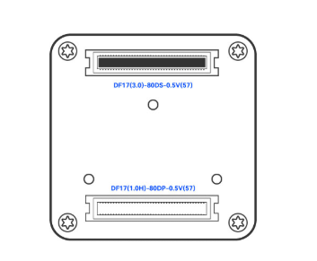
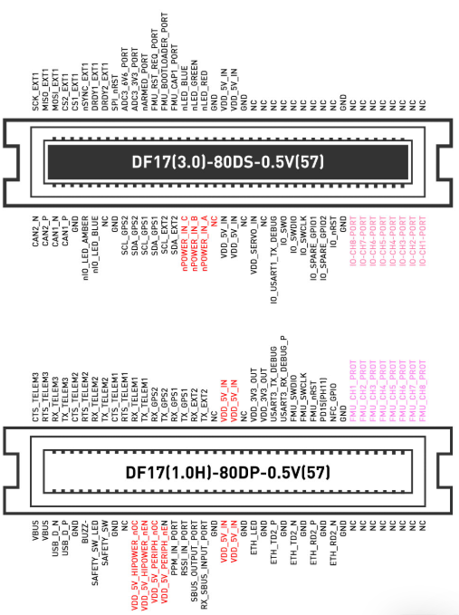

# DF17 连接器资料

X9 Core 底部有两颗 **80pin** 板对板 DF17 连接器，载板设计需同时对接。

## 参考图

| 图 | 说明 |
|----|------|
|  | 飞控底部两颗 DF17 位置（上 **80DS**、下 **80DP**） |
|  | 80DS + 80DP 完整引脚图（官方） |

源文件：

- [images/X9-Core-DF17-connector-layout.png](images/X9-Core-DF17-connector-layout.png)
- [images/X9-Core-DF17-pinout-dual.png](images/X9-Core-DF17-pinout-dual.png)

## CAD（底面机械）

| 文件 | 说明 |
|------|------|
| [cad/X9-Core-bottom.dxf](cad/X9-Core-bottom.dxf) | Core 底面机械 DXF |
| [cad/carrier-pcb.dxf](cad/carrier-pcb.dxf) | **载板 PCB DXF**（Top View，导入 EasyEDA） |
| [cad/X9-Core-bottom-reference.png](cad/X9-Core-bottom-reference.png) | 官方底面机械图 |
| [cad/README.md](cad/README.md) | 图层、尺寸、生成说明 |

```bash
pip install ezdxf
python tools/generate_x9_bottom_cad.py
python tools/generate_carrier_pcb_dxf.py
```

## 原理图（Core 载板 · 仅双 DF17）

| 文件 | 说明 |
|------|------|
| [schematic/Core底板-原理图.md](schematic/Core底板-原理图.md) | 单页原理图规格：J1(80DP) + J2(80DS) |
| [schematic/core-carrier-schematic-spec.json](schematic/core-carrier-schematic-spec.json) | 机器可读引脚/布局规格 |

生成：`python tools/setup_core_carrier_schematic.py`

## JLCEDA MCP

Cursor ↔ 嘉立创 EDA 桥接：`ws://127.0.0.1:8760/bridge/ws`  
配置与故障修复见 [JLCEDA-MCP-配置与修复.md](JLCEDA-MCP-配置与修复.md)

| 座子型号 | 文档 | 主要功能 |
|----------|------|----------|
| DF17(3.0)-80DS-0.5V(57) | [DF17-80DS-pinout.md](DF17-80DS-pinout.md) | SPI、CAN、I2C、IO 侧 PWM/SWD |
| DF17(1.0H)-80DP-0.5V(57) | [DF17-80DP-pinout.md](DF17-80DP-pinout.md) | UART、FMU PWM、以太网、USB、RC、电源控制 |

## 数据库

结构化数据存放在 SQLite：`db/pinout.db`

| 文件 | 说明 |
|------|------|
| [db/schema.sql](../db/schema.sql) | 表结构（products / connectors / pins） |
| [tools/import_df17_pinout.py](../tools/import_df17_pinout.py) | 从 Markdown 导入/更新数据库 |

```bash
python tools/import_df17_pinout.py
```

常用查询示例：

```sql
-- 某座子全部引脚
SELECT pin_number, signal_name, category, row, row_position
FROM pins p JOIN connectors c ON p.connector_id = c.id
WHERE c.part_number = 'DF17(3.0)-80DS-0.5V(57)'
ORDER BY pin_number;

-- 按信号名搜索
SELECT c.part_number, p.pin_number, p.signal_name
FROM pins p JOIN connectors c ON p.connector_id = c.id
WHERE p.signal_name LIKE '%CAN%'
ORDER BY c.part_number, p.pin_number;
```

## 编号约定

- **左上 = Pin 1**
- **左下 = Pin 80**
- 上行 1→40 自左向右；下行 80→41 自左向右

## 待补充

- [x] 底面机械 CAD（见 [cad/X9-Core-bottom.dxf](cad/X9-Core-bottom.dxf)；M2 孔位待官方复核）
- [ ] 载板侧网络名与原理图符号核对
